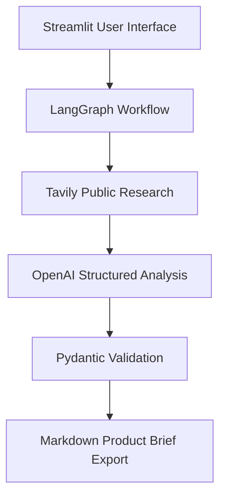

# Competitor Intelligence Engine

“An evidence-grounded multi-agent AI prototype that transforms public competitor research into strategic product opportunities and implementation-ready backlog recommendations.”

---

## Project Status

This repository is an **active portfolio prototype under development**. It serves as a proof of concept demonstrating how multi-agent LLM architectures can automate competitor research, strategic synthesis, and backlog writing. 

* **Status:** Groundwork complete. Porting local CLI workflows to an interactive deployment environment.
* **Target Environment:** Hosted on **Hugging Face Spaces**.

---

## Problem

Product managers, strategy leads, and founders spend hours manually scanning competitor websites, press releases, and articles to extract market insights. Transitioning these insights into actionable planning artifacts (like SWOT analyses, opportunity gaps, and backlogs) is highly manual, error-prone, and disconnected from original source materials. This often leads to:
* Ungrounded strategic assumptions.
* Out-of-date competitive intelligence.
* Product backlogs that lack explicit alignment with documented competitor gaps.

---

## Solution

The **Competitor Intelligence Engine** is an **evidence-grounded multi-agent AI prototype** designed to automate this workflow securely and accurately. Utilizing a multi-agent system, the tool retrieves public research, performs a structured SWOT analysis, reveals opportunity gaps, and converts those insights into a structured product backlog. Key outputs include:
* An **executive summary** highlighting major takeaways.
* A **source-grounded SWOT** analysis directly tied to public documentation.
* **Three to five opportunity gaps** based on competitor deficiencies.
* **Exactly one Epic** with **exactly three user stories** containing **testable acceptance criteria**.
* Access to a **downloadable Markdown brief** containing the full analysis and associated backlog.

---

## Core Capabilities

The prototype is designed with two distinct operation profiles:

1. **Demo Mode**
   * Designed for the general public, recruiters, and showcase situations.
   * Completely static and fictional, utilizing preloaded historical datasets.
   * **Makes no external API calls**, protecting third-party rate limits and API budgets.
2. **Live Research Mode**
   * Pulls real-time Web data for a specified competitor URL using **public research only**.
   * Requires a valid **`LIVE_RESEARCH_ACCESS_CODE`** environment variable or session key to unlock, securing the backend from unauthorized public API usage.
   * Provides **evidence source links** alongside every claim generated to ensure transparency and enable **human validation**.

---

## Architecture

The system utilizes an orchestrator-agent pattern built on LangGraph to coordinate the flow of information between specialized tasks.



### Flow of Execution
1. **User Interface (Streamlit):** The user enters a competitor URL and selects the execution mode. If Live Research Mode is selected, the `LIVE_RESEARCH_ACCESS_CODE` is verified.
2. **Workflow Orchestration (LangGraph):** A stateful graph coordinates execution between three specialized agents: the Research Agent, the Strategic Analyst, and the Backlog Writer.
3. **Information Retrieval (Tavily):** The Research Agent fetches real-time public data, generating source-grounded references.
4. **Strategic Synthesis (OpenAI):** The Strategic Analyst evaluates raw content to generate SWOT analysis and opportunity gaps.
5. **Contract Verification (Pydantic):** The Backlog Writer drafts the Epic and user stories, enforcing structure and validation through strict Pydantic schemas.
6. **Data Output:** Results are rendered in the Streamlit UI and compiled into a downloadable Markdown brief.

---

## AI Safety and Guardrails

To protect both system stability and output reliability, the prototype implements the following safety controls:
* **Untrusted Content Handling:** External web page content is treated strictly as untrusted reference data. It is never mixed directly into system prompt instructions, mitigating prompt-injection risks.
* **Access Control:** Live execution is gate-kept via the `LIVE_RESEARCH_ACCESS_CODE`, stopping unauthorized usage and billing spikes.
* **Groundedness Over Completeness:** The system prioritizes grounding every statement in a validated URL source. In accordance with safety limitations, the system *does not* guarantee factual completeness or hallucination-free output. Instead, it surfaces links directly so human reviewers can validate assertions.
* **Deterministic Guardrails:** Output formatting is strictly checked using Pydantic schemas, raising errors or triggering automatic retries if structural requirements (e.g., number of user stories) are violated.

---

## Technology Stack

The application codebase is implemented using a modern Python-based stack:
* **UI Framework:** Streamlit
* **Agentic Graph:** LangGraph
* **Search Infrastructure:** Tavily API
* **Large Language Models:** OpenAI API
* **Validation & Schemas:** Pydantic
* **Testing Suite:** Pytest
* **Containerization:** Docker
* **Hosting Platform:** Hugging Face Spaces

---

## Repository Structure

```
├── .dockerignore
├── .env.example
├── .gitignore
├── Dockerfile
├── LICENSE
├── README.md                 <-- Recruiter-friendly introduction and overview
├── BUILD_PLAN.md             <-- Development milestones, architectural rules, and technical steps
├── app.py                    <-- Streamlit frontend interface entrypoint
├── agent_logic.py            <-- LangGraph definition and agent execution logic
├── schemas.py                <-- Pydantic definitions for structured outputs
├── demo_data.py              <-- Pre-baked static datasets for public Demo Mode
├── utils.py                  <-- Helper utilities (markdown compilers, access code verifiers)
├── requirements.txt          <-- Production dependencies
├── requirements-dev.txt      <-- Development and testing dependencies
├── docs/                     <-- Architectural and product research documents
│   └── 01_project_charter.md <-- High-level vision, JTBD, success metrics, and non-goals
└── tests/                    <-- pytest suite verifying agent steps and Pydantic validation
```

---

## Roadmap

The project development is broken down into structured sprints testing specific **product hypotheses**:
1. **Milestone 1:** Establish documentation, schemas, baseline testing infrastructure, and static Demo Mode.
   * *Hypothesis:* Standardizing interface outputs via strict Pydantic schemas ensures 100% compliance with downstream agile tool schemas (e.g., Jira import format).
2. **Milestone 2:** Implement LangGraph orchestrator and integrate Tavily search for Live Research Mode.
   * *Hypothesis:* Treating web page content as untrusted input references ensures the system remains robust against direct prompt injections hosted on target competitor domains.
3. **Milestone 3:** Implement human-in-the-loop validation checkpoints in the Streamlit UI, allowing PMs to edit SWOT analyses before stories are generated.
   * *Hypothesis:* Giving PMs a human validation checkpoint after research improves the strategic relevance of generated user stories by over 50%.
4. **Milestone 4:** Full deployment to Hugging Face Spaces with Docker.

---

## Disclaimer

This is a prototype designed for demonstration purposes, utilizing public data only. It does not guarantee complete data coverage or hallucination-free generation. Do not input proprietary, confidential, or sensitive competitive information. Keep human-in-the-loop validation active prior to acting on generated backlog elements.
