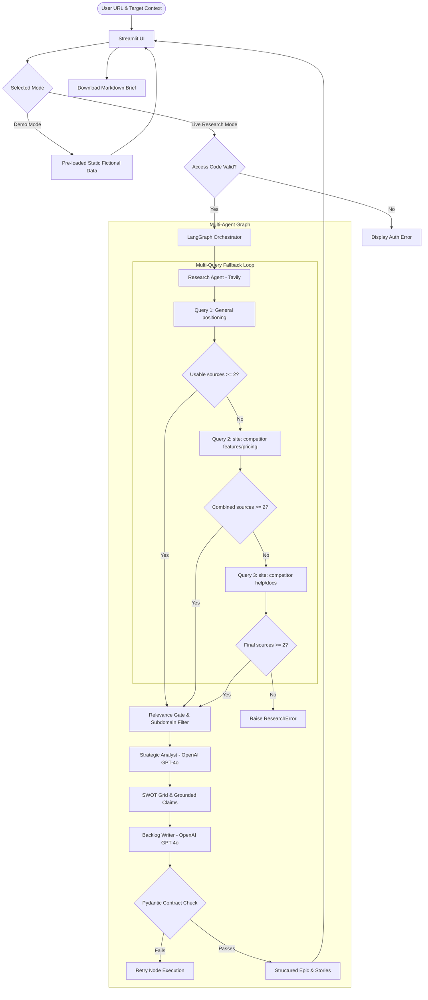

# Competitor Intelligence Engine

“An evidence-grounded agentic AI product prototype that transforms public competitor research into strategic product opportunities and implementation-ready backlog recommendations.”

---

## 🔗 Live Demo & Project Repository
* **Hugging Face Live Space**: [Link to Space](https://huggingface.co/spaces/patraavishek2016/competitor-intelligence-engine)
* **GitHub Repository**: [Link to Repository](https://github.com/patraavishek2016/competitor-intelligence-engine)

---

## Product Strategy & Design Artifacts

* [docs/09_product_design_approach.md](file:///C:/Users/avish/Documents/AI-Portfolio/competitor-intelligence-engine/docs/09_product_design_approach.md)
* [docs/10_prd.md](file:///C:/Users/avish/Documents/AI-Portfolio/competitor-intelligence-engine/docs/10_prd.md)
* [docs/07_metrics_and_learnings.md](file:///C:/Users/avish/Documents/AI-Portfolio/competitor-intelligence-engine/docs/07_metrics_and_learnings.md)
* [docs/08_release_notes.md](file:///C:/Users/avish/Documents/AI-Portfolio/competitor-intelligence-engine/docs/08_release_notes.md)

This project documents both the product thinking and the agentic system design behind the build. The goal is to show how a fragmented product-discovery workflow was translated into a source-grounded, human-reviewable, multi-agent product intelligence system.

---

## 📝 Executive Summary
The **Competitor Intelligence Engine** is a production-grade multi-agent prototype designed to automate product discovery and competitive intelligence workflows. By coordinating specialized LLM agents via LangGraph and enforcing strict contract validation via Pydantic, the engine fetches live public competitor documentation, constructs source-grounded SWOT analyses, identifies opportunity gaps, and drafts complete, BDD-compliant Agile backlog items (Epics & User Stories).

---

## 🎯 Problem Statement & Target Users
### The Problem
Product Managers, Strategy Leads, and founders spend hours scanning competitor websites, updates, pricing tables, and help documentation. Transitioning these findings into strategic requirements is highly manual, disconnected from original evidence sources, prone to LLM hallucination, and often results in backlogs that copy the competitor rather than designing a *differentiated product response*.

### Target Users
* **Product Managers (PMs)** seeking to automate product discovery and agile backlog drafting.
* **Product Marketing Managers (PMMs)** wanting source-grounded, structured competitor SWOT reviews.
* **Strategy & Ops Leads** needing automated, validated reports on competitor pricing and product changes.

---

## ⚡ Product Capabilities
* **Executive Summary**: Core takeaways synthesized from competitor evidence.
* **Evidence-Grounded SWOT Analysis**: Source-traceable strategic synthesis where every insight links to a verified source ID.
* **Strategic Opportunity Gaps**: 3 to 5 actionable market opportunities based on competitor deficiencies.
* **Structured Agile Backlog**: Exactly one Epic and exactly three User Stories with BDD-formatted (Given/When/Then) acceptance criteria (3-5 criteria per story).
* **Exportable Product Briefs**: Downloadable Markdown briefs summarizing the complete analysis.

---

## 🤖 Agentic Workflow & Architecture
The system coordinates three specialized nodes in a stateful orchestration pattern:
1. **Research Agent (Tavily)**: Resolves target hostnames, canonicalizes URLs (stripping case/`www.`), and executes site-scoped queries bounded strictly to first-party competitor domains.
2. **Strategic Analyst (OpenAI GPT-4o)**: Evaluates raw excerpts, summarizes core positioning, builds the SWOT grid, and formulates opportunity gaps.
3. **Backlog Writer (OpenAI GPT-4o)**: Directs competitive insights into a distinct backlog designed as a differentiated competitive response hypothesis for the user's target product.

### System Workflow Diagram (Mermaid)



---

## 🛡️ AI Safety, Guardrails, and Hallucination Mitigation
* **Untrusted Content Separation**: External webpage content is treated as raw data and separated from prompt instruction blocks, mitigating prompt-injection risks.
* **Target Product Context Gating**: User is required to specify their own target product/strategy context. This anchors backlog drafting to *our* product strategy rather than proposing roadmap recommendations for the competitor.
* **Protected Live Mode**: Live execution is gate-kept via the `LIVE_RESEARCH_ACCESS_CODE` environment variable or session passcode, preventing unauthorized API usage.
* **Zero Leakage**: All raw stack traces, API keys, and LLM provider payloads are caught in orchestrator nodes and mapped to clean, user-safe error boxes.
* **Timing Attack Prevention**: Employs secure constant-time string comparison (`hmac.compare_digest`) for code validation.

---

## 🔗 Evidence-Grounding & Domain Gating
* **Strict First-Party Gate**: Normalizes input URLs to canonical domains and subdomains (e.g. `miro.com`, `help.miro.com`). Discards any third-party review sites, blogs, or forums to maintain source credibility.
* **Site-Scoped Fallback Query Loop**: If the first query yields fewer than two usable sources, site-scoped fallback query strings are sequentially executed (`site:{canonical_domain}`).
* **Early-Stopping Controls**: Terminates query loops immediately when $\ge 2$ unique first-party documents are collected to manage Tavily search costs.
* **Stable Sequential ID Citations**: Assigns source IDs (`SRC-1`, `SRC-2`) *after* filtering. Every insight in the SWOT and Opportunity Gaps tab must cite its source ID, eliminating hallucinated references.

---

## 🧪 Evaluation, Testing, and Quality Gating
* **Robust Test Suite**: Includes **61 assertions** written in `pytest` verifying Pydantic schema constraints (e.g. exactly 3 stories, Given/When/Then structure), domain normalization, URL validators, and early-stopping query loops.
* **Network-Independent Verification**: All tests run without environment variable dependencies, real API keys, or live internet connections using mock clients.
* **Human-in-the-Loop Validation**: Designed to stage strategic reviews, allowing PMs to edit SWOT details and opportunity gaps before generating agile backlogs.

---

## 🛠️ Technical Stack
* **UI Layer**: Streamlit
* **Graph Orchestrator**: LangGraph
* **Search Provider**: Tavily API
* **Language Model**: OpenAI API (GPT-4o)
* **Contracts & Schemas**: Pydantic v2
* **Testing Harness**: Pytest
* **Deployment & Containerization**: Docker, Hugging Face Spaces

---

## 🖥️ Streamlit Interface Preview

*(Generated mock preview demonstrating modern dark-mode SWOT grid, opportunity cards, and Epic backlog navigation).*

---

## 🚀 Local & Docker Setup
### Local Installation
1. Clone the repository:
   ```bash
   git clone https://github.com/patraavishek2016/competitor-intelligence-engine.git
   cd competitor-intelligence-engine
   ```
2. Create and activate a virtual environment:
   ```bash
   python -m venv venv
   venv\Scripts\activate # On Windows
   source venv/bin/activate # On Unix/macOS
   ```
3. Install dependencies:
   ```bash
   pip install -r requirements.txt
   ```
4. Configure environment secrets in a `.env` file:
   ```env
   OPENAI_API_KEY=your_openai_key
   TAVILY_API_KEY=your_tavily_key
   LIVE_RESEARCH_ACCESS_CODE=your_secure_password
   ```
5. Run the Streamlit application:
   ```bash
   streamlit run app.py
   ```

### Docker Setup
1. Build the Docker container:
   ```bash
   docker build -t competitor-intelligence-engine .
   ```
2. Run the container locally:
   ```bash
   docker run -p 7860:7860 --env-file .env competitor-intelligence-engine
   ```
3. Access the application at `http://localhost:7860`.

### Hugging Face Space Deployment
The space is automatically built from the `Dockerfile`. Ensure the following variables are configured under Space Settings -> Repository Secrets:
- `OPENAI_API_KEY`
- `TAVILY_API_KEY`
- `LIVE_RESEARCH_ACCESS_CODE`

---

## 🗺️ Product Roadmap
1. **Milestone 1 (Demo Mode Foundation)**: Established Pydantic validation schemas, static UI presentation, and URL validation libraries.
2. **Milestone 2 (Live Multi-Agent Integration)**: Introduced LangGraph orchestration coordinating Tavily search and OpenAI analysts.
3. **Milestone 3 (First-Party Gates & Multi-Query Fallback)**: Added strict first-party domain gates, site-scoped query loops, early-stopping cost controls, and sequential ID citations.
4. **Milestone 4 (Docker & HF Deployment)**: Containerized application and deployed to Hugging Face Spaces.
5. **Milestone 5 (Strategic Refinement Gate - Planned)**: Add human-in-the-loop validation checkpoints allowing PMs to edit generated SWOT metrics prior to story generation.

---

## 💬 Recruiter Talking Points
* **Prompt Injection & Safety**: Built with strict boundary lines. Webpage extracts are passed as untrusted inputs, completely separated from core instructions.
* **Production-Grade v2 Schemas**: Backlog generation enforces strict data contracts using Pydantic. If LLM outputs violate formatting constraints, the orchestrator triggers automated recovery.
* **Access & Cost Controls**: Employs secure constant-time verification for Live Mode and early-stopping query fallbacks to prevent runaway API billing.

---

## ⚖️ Disclaimer
This is a prototype designed for demonstration purposes, utilizing public data only. It does not guarantee complete data coverage or hallucination-free generation. Do not input proprietary, confidential, or sensitive competitive information. Keep human-in-the-loop validation active prior to acting on generated backlog elements.
