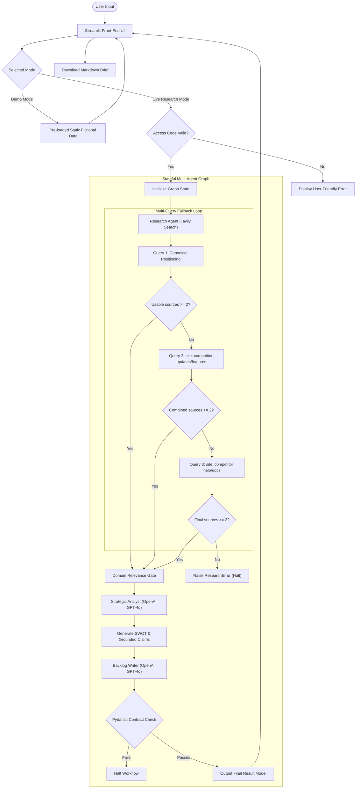

# System Architecture

---

## Architecture Overview
The **Competitor Intelligence Engine** is designed as a stateful, event-driven multi-agent system built on top of the LangGraph coordination framework. The system architecture decouples the front-end user experience (Streamlit) from the underlying multi-agent execution graph, enforcing strict Pydantic v2 data contracts between execution boundaries.

The core architecture follows a hub-and-spoke state orchestration pattern:
1. **User Action**: The user inputs a competitor URL and strategic context in Streamlit.
2. **State Initialization**: The graph state is populated with initial settings.
3. **Research Node**: Fetches and filters public webpages.
4. **Analyst Node**: Evaluates evidence and produces SWOT insights.
5. **Backlog Node**: Compiles strategic response Epics and User Stories.
6. **Validation Layer**: Re-evaluates outputs against data schemas, raising faults if constraints are breached.

---

## Architecture Sequence & Workflow (Mermaid Diagram)

---

## Agent Node Details

### Research Agent
* **Role**: Query public search engines for competitor documents.
* **Technology**: Tavily Search API.
* **Functionality**:
  1. Resolves and normalizes target hostnames (e.g., strips `www.` and normalizes casing to form a canonical root domain).
  2. Restricts searches to first-party competitor domains using inclusion filters.
  3. Executes up to three queries sequentially using site-scoped keywords if fewer than two usable documents are retrieved.
  4. Implements early-stopping to terminate search operations as soon as $\ge 2$ unique pages are retrieved, managing external query costs.

### Strategic Analyst
* **Role**: Analyze unstructured competitor excerpts and map opportunity gaps.
* **Technology**: OpenAI API (GPT-4o).
* **Functionality**:
  1. Parses raw web texts and filters out irrelevant third-party materials.
  2. Synthesizes a SWOT grid (Strengths, Weaknesses, Opportunities, Threats).
  3. Formulates 3 to 5 market opportunity gaps.
  4. Generates source citations (e.g. `SRC-1`) for every SWOT item and opportunity card, ensuring complete evidence traceability.

### Backlog Writer
* **Role**: Translate strategic analyst conclusions into development specifications.
* **Technology**: OpenAI API (GPT-4o).
* **Functionality**:
  1. Synthesizes SWOT opportunity cards with the user's custom strategy context.
  2. Frames all stories as a *differentiated product response* for *our* product rather than copycat features.
  3. Outputs exactly one Epic and exactly three User Stories with 3-5 Given/When/Then acceptance criteria.

---

## Pydantic Validation Layer
The application maintains strict data integrity using **Pydantic v2** models to guard core boundaries:
* **Contract Verification**: Every agent node must return a schema-compliant dictionary that matches defined models (e.g., `SWOTAnalysis`, `OpportunityGap`, `UserStory`, `Epic`).
* **BDD Parser Gate**: The validator checks every User Story's acceptance criteria using regular expressions to confirm that the keywords `Given`, `When`, and `Then` are all present. If criteria fail this check, the validation gate raises an error.
* **Citation Traceability Check**: programmatically asserts that all SWOT points and opportunity cards contain a valid `source_ids` entry that correlates to the index list compiled by the Research Agent.

---

## Human Review Boundary
The multi-agent graph enforces a clear division between automated synthesis and human product execution:
* **Strategy Gating**: The backlog writer cannot execute unless the user defines a target context, preventing autonomous, undirected backlog creation.
* **Static Verification**: The SWOT grid, Opportunity Gaps, and Backlog items are rendered in a structured tabbed layout in the Streamlit UI, encouraging the PM to inspect and edit details before copying or downloading the results.
* **Review Disclaimer**: A persistent disclaimer reinforces that the outputs are generated proposals that must be reviewed by the product team before being committed to Jira.

---

## Demo Mode vs Live Research Mode
* **Demo Mode**: Bypasses the LangGraph executor entirely. It imports a static fictional analysis of a competitor called `NimbusFlow` (using `.example` domains) from [demo_data.py](file:///C:/Users/avish/Documents/AI-Portfolio/competitor-intelligence-engine/demo_data.py). This allows users to experience the front-end layout instantly without incurring API costs.
* **Live Research Mode**: Executes the active LangGraph orchestration. Requires a passcode check to authorize the run, then coordinates Tavily and OpenAI API calls asynchronously before updating the Streamlit session state.

---

## Deployment Architecture

### GitHub Repository & Version Control
Acts as the central source code repository, tracking all design documents and configuration files. CI workflows can be configured to execute the test suite automatically on branch merges.

### Docker Containerization
The application is wrapped in a portable container using a lightweight Python image. The configuration exposes Streamlit's default port (`7860`) and mounts environment variables safely at runtime.

### Hugging Face Spaces
Serves as the public deployment host. Deployed on a Hugging Face Space utilizing the Docker SDK. The Space runs on a CPU Basic instance and binds secrets (`OPENAI_API_KEY`, `TAVILY_API_KEY`, `LIVE_RESEARCH_ACCESS_CODE`) in the Space Settings pane.

### Vercel Portfolio Integration
The project is showcased on a public Vercel portfolio site, where a dedicated landing page describes the product design and contains action links pointing directly to the Hugging Face Space demo instance.

---

## Failure Handling and Safety Boundaries
* **Access Control**: Secure constant-time string comparison (`hmac.compare_digest`) validates the access code, protecting the backend from timing attacks.
* **No Secret Leakage**: If an API call fails or a validation error occurs inside a node, the exception is caught, logged on the server, and a clean error message (e.g., `"Research agent was unable to extract enough competitor evidence."`) is shown in the UI. No stack traces or prompt configurations are displayed to the client.
* **Domain Gating**: Discards third-party URLs to prevent scrapers from processing biased or SEO-optimized content, restricting analysis strictly to first-party competitor claims.
* **Search Caps**: Restricts search outputs to 5 results per query, avoiding token inflation and mitigating billing runs.
