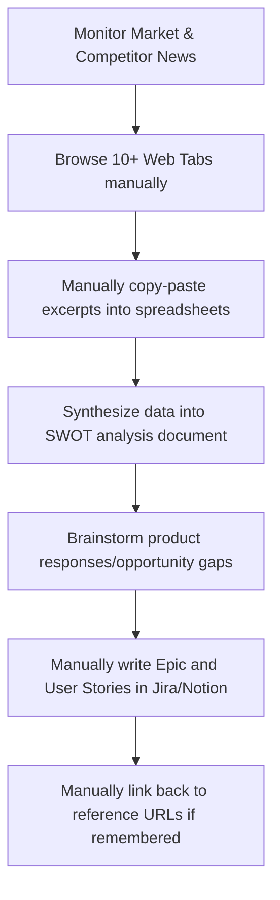

# Avishek’s Product Design Approach: Competitor Intelligence Engine

## 1. Why I Built This
Product Managers (PMs), Product Owners (POs), Strategy Analysts, Startup Founders, and AI Product Builders spend an enormous amount of time manually collecting fragmented competitor information. They crawl websites, browse feature tables, read pricing updates, scan product changelogs, search customer review platforms, and sift through public press releases. 

However, the deepest customer pain point is not merely the *collection* of competitor research; it is the *transition* of that raw research into evidence-backed product decisions, backlog-ready epics, and implementation-ready requirements. Collecting data without structure creates strategic noise. Translating that data manually into product requirements is slow, prone to cognitive bias, and separates the written user story from the primary evidence. 

The Competitor Intelligence Engine was built to solve this exact problem. By automating research gathering through a controlled agentic workflow, it synthesizes competitive telemetry, maps opportunity gaps, and drafts standard user stories that are directly grounded in source evidence. This shrinks the time-to-backlog loop from hours to minutes, ensuring that roadmap decisions are backed by verifiable competitive realities.

---

## 2. Current Customer Journey
The manual workflow typically followed by product teams to track competitors looks like this:

1. **Information Monitoring**: The PM notices a new announcement or release from a key competitor.
2. **Ad-hoc Research**: The PM opens multiple browser tabs, scanning the competitor's pricing pages, documentation, and blog posts.
3. **Data Aggregation**: Excerpts are copied and pasted into a shared team spreadsheet or document, which quickly becomes stale and disorganized.
4. **Synthesis**: The PM drafts a high-level SWOT analysis or a strategy slide deck to present to engineering and design leadership.
5. **Ideation**: Product teams brainstorm how our own product should respond to this competitive shift.
6. **Requirements Drafting**: The PM manually drafts an Epic and several User Stories in Jira, writing acceptance criteria from scratch.
7. **Source Alignment**: In the final backlog item, the original context (URLs, quotes) is often lost, leaving developers with zero context on *why* a feature is being built.

---

## 3. Friction Points in the Journey
* **High Cognitive Load**: Evaluating raw marketing claims vs. actual product features requires constant verification.
* **Lack of Evidence Traceability**: Once a user story is written, it is almost impossible to trace it back to the exact competitor landing page or changelog entry that inspired it.
* **Ungrounded Strategic Assumptions**: PMs risk writing requirements based on outdated assumptions or surface-level competitor claims.
* **Execution Latency**: It takes hours or days to translate a competitor update into an actionable product brief and backlog ticket.
* **Roadmap Disconnection**: Generated stories often lack clear differentiation, resulting in team copying of competitor features rather than structured responses.

---

## 4. Discovery Questions
To validate the necessity of the tool, the following discovery questions were defined:
* *How do product teams currently keep track of competitor changes, and where is that data stored?*
* *How long does it take to go from identifying a competitor feature to having a refined user story in the backlog?*
* *How do engineers verify the source context of a competitive requirement? Do they read the raw competitor documentation?*
* *What is the ratio of raw competitor summary vs. actual strategic opportunity mapping in existing intelligence documents?*
* *Where do LLMs fail when generating requirements for product teams? (e.g., lack of source validation, formatting errors).*

---

## 5. Working Assumptions
* **First-Party Data is Truth**: Competitor first-party sites (pricing, features, documentation, changelogs) provide the highest quality indicators of product strategy.
* **Controlled Agency**: LLM agents must be strictly constrained using structured Pydantic schemas. Unstructured LLM outputs fail integration tests.
* **Target Context is Essential**: Generative AI cannot write a useful backlog item without knowing our *own* target product strategy and constraints. Without it, the AI simply suggests building what the competitor has.
* **Public Domain Only**: The tool must run securely using public-facing web URLs, requiring no proprietary competitor logins or scraping.

---

## 6. Product Goal
Deliver an automated, evidence-grounded agentic workspace that enables product builders to convert public competitor URLs and their own strategic goals into validated SWOT analyses, opportunity gaps, and backlog-ready Markdown briefs in under two minutes.

---

## 7. Problem Statement
> **How might we** enable product managers and startup founders to rapidly extract strategic opportunities from competitor websites and automatically translate them into source-grounded backlog requirements, without losing the link between user stories and competitive evidence?

---

## 8. Detailed 3C Analysis

### Customer
* **Who**: Product Managers, Product Owners, Strategy Analysts, Startup Founders, and AI Product Builders.
* **Need**: Rapid synthesis of competitor features and fast transition to execution artifacts.
* **Key Pain**: Lost source links, manual drafting overhead, and requirements that don't match the company's own strategy.

### Company / Builder Context
* **Constraints**: Minimal database overhead, local prototype constraints, API token limits, and dependency on public indexing (Tavily/OpenAI).
* **Capabilities**: Built using LangGraph, Python, Streamlit, and Pydantic validation.
* **Aspiration**: Showcase a production-grade multi-agent architecture with bulletproof error handling, demo guardrails, and real-time execution.

### Competition / Alternatives
* **Manual Tracking (Spreadsheets)**: Free but highly static, high maintenance, and quickly out of date.
* **Enterprise CI Platforms (Klue, Crayon)**: Extremely expensive ($10k+/yr), complex setup, heavy focus on sales enablement rather than PM backlog creation.
* **Generic LLM Chatbots (ChatGPT, Claude)**: Good at summarizing text but prone to hallucinations, lack domain-specific validation (e.g. BDD format), cannot build multi-query search fallbacks, and lack direct evidence tracing.

---

## 9. User Personas

### Persona A: B2B SaaS Senior Product Manager
* **Demography / Context**: PM at a mid-market CRM startup. Manages a team of 8 engineers.
* **Persona Description**: Heavily focused on roadmap prioritization. Constantly requested by sales leads to "match competitor features".
* **Goals**: Evaluate competitor feature releases, identify opportunity gaps, and write user stories for the development team.
* **Pain Points**: Spends too many hours rewriting user stories; engineering rejects stories that lack detailed acceptance criteria.
* **Existing Workaround**: Copy-pastes text from competitor pages into a Google Doc, writes a quick summary, and manually copies it into Jira.
* **What Success Looks Like**: A source-grounded Markdown brief containing structured BDD stories that can be directly pasted into the backlog, with competitor reference URLs included in every story.

### Persona B: Startup Founder
* **Demography / Context**: Solo founder building a developer tool. Very limited time.
* **Persona Description**: Needs to define a product MVP. Needs to find underserved opportunity gaps in dominant competitor platforms.
* **Goals**: Quickly run SWOT analyses on 3-4 competitors to refine the product's value proposition.
* **Pain Points**: Lacks the time to write full PRDs or product briefs; needs immediate strategic alignment.
* **Existing Workaround**: Browses competitor pricing pages late at night and takes scattered screenshots.
* **What Success Looks Like**: Getting a structured, source-backed list of opportunity gaps and an Epic detailing how the MVP should be positioned against the competitor.

### Persona C: Market Strategy Analyst
* **Demography / Context**: Strategy analyst in an enterprise software company.
* **Persona Description**: Conducts deep-dive competitor sweeps every quarter for the executive team.
* **Goals**: Gather verified source telemetry, catalog competitor updates, and present SWOT reports.
* **Pain Points**: Spent hours verifying whether a marketing bullet point is actually supported by first-party pricing/features pages.
* **Existing Workaround**: Builds massive, complex Excel sheets with manual links.
* **What Success Looks Like**: An automated sweep of competitor URLs that returns verifiable, structured SWOT metrics and downloadable briefs.

---

## 10. Pain Point to Feature Mapping

| Identified Pain Point | Product Feature | How it Solves the Pain |
| :--- | :--- | :--- |
| **Lost Source References** | Source-Grounded Evidence (`source_ids`) | Every SWOT point and opportunity gap must explicitly reference a verified search result ID (`SRC-X`). |
| **Out-of-Scope Backlog Items** | Target Strategy Context Input | Enforces that all generated requirements are framed as responses for *our* product, not features for the competitor. |
| **Hallucinated or Malformed User Stories** | Pydantic BDD Validation | Enforces that all stories contain `Given/When/Then` syntax and output exactly 3 stories per Epic. |
| **API Cost and Access Leaks** | Secure Access Gate + Demo Mode | Protects the system from unauthorized live search API hits while allowing public review via static Demo Mode. |
| **Unreliable Search Recall** | Site-Scoped Fallback Queries | Sequential site-scoped searches guarantee high recall for first-party competitor sites even if standard keywords fail. |

---

## 11. Feature Prioritization

### P0 (Core Capabilities - Must Have)
* **Structured Demo Mode**: View static competitor results without API credentials.
* **Structured schemas (Pydantic)**: Ensure strict structures for SWOT and Backlog.
* **First-Party Evidence Relevance Gate**: Filter out external blogs, forums, and third-party pages.
* **Target Product Context Gating**: Force B2B strategy context inputs.

### P1 (UX and Orchestration - Should Have)
* **LangGraph Orchestrator**: State management, linear step transition.
* **Downloadable Markdown Brief**: Export capability.
* **Multi-Query Site-Scoped Fallbacks**: Ensure recall on complex domains.

### P2 (Advanced Analytics - Nice to Have)
* **Database persistence**: Storing historic analysis results.
* **Interactive Human Edit node**: Ability for PM to edit the SWOT table inside the Streamlit UI before generating user stories.

---

## 12. OKRs

* **Objective 1**: Reduce competitor research-to-backlog latency for product builders.
  * **KR 1.1**: Decrease the time taken to produce a verified competitive epic and stories from 2 hours to under 2 minutes.
  * **KR 1.2**: Maintain a 100% completion rate for Pydantic validation across all live execution runs.
* **Objective 2**: Establish trust and evidence traceability in LLM-generated backlog items.
  * **KR 2.1**: Achieve 100% citation coverage, ensuring every SWOT item and opportunity gap references a valid `source_id`.
  * **KR 2.2**: 0% external blog source leakage through strict first-party relevance gates.
* **Objective 3**: Minimize public prototype maintenance costs while ensuring accessibility.
  * **KR 3.1**: Zero billing spikes on live Tavily/OpenAI endpoints via access code gate.
  * **KR 3.2**: 100% of public visitors can instantly run the demo brief generator using static Demo Mode.

---

## 13. Product Design Summary
The Competitor Intelligence Engine is designed to bridge the gap between competitive telemetry and agile product requirements. The product UI is designed for focus, utilizing a tabbed layout to separate strategic synthesis (SWOT, Opportunity Gaps) from backlog artifacts (Epic, User Stories) and source evidence.

---

## 14. Why Agentic AI Is Needed
A single, long prompt sent to a standard LLM is insufficient for this workflow. Large language models struggle when asked to simultaneously search the web, analyze strategic positioning, write user stories, and enforce strict JSON schemas. 

By splitting this problem into a coordinated multi-agent workflow using LangGraph:
1. **Research Agent**: Focuses solely on domain normalization, web search, and first-party domain filtration.
2. **Strategic Analyst**: Evaluates the cleaned data, drafts the SWOT, and identifies gaps while mapping citation structures.
3. **Backlog Writer**: Consumes the SWOT and target context to write detailed agile stories.
4. **Pydantic Validation**: Programmatically guarantees that no requirements go to production with missing acceptance criteria or malformed BDD structures.

This division of labor minimizes cognitive drift in the LLM, improves groundedness, and guarantees schema stability.

---

## 15. Human-in-the-Loop Boundary
While the multi-agent system accelerates the writing of backlog tickets, the product enforces a clear safety boundary: **the AI drafts, the human decides**. 
* The system is a copilot. The outputs are staged, and a warning disclaimer is displayed on the UI.
* Product Managers must review the generated Epic and User Stories before importing them into their development trackers.
* The downloadable Markdown brief serves as a reviewable document to foster team alignment before engineering kickoff.

---

## 16. What I Would Improve Next
1. **Interactive Human-in-the-Loop State Node**: Add a UI step where PMs can edit or delete SWOT items before the Backlog Writer generates the final stories.
2. **Jira Integration**: Create a direct "Push to Jira" button using webhooks to export epics and stories.
3. **Multi-Competitor Matrix**: Allow researchers to input up to three competitor URLs to construct a unified comparative matrix.
4. **Continuous Monitoring**: Run the Research Agent on a weekly cron job to detect pricing or packaging changes automatically, notifying the PM of strategic updates.
