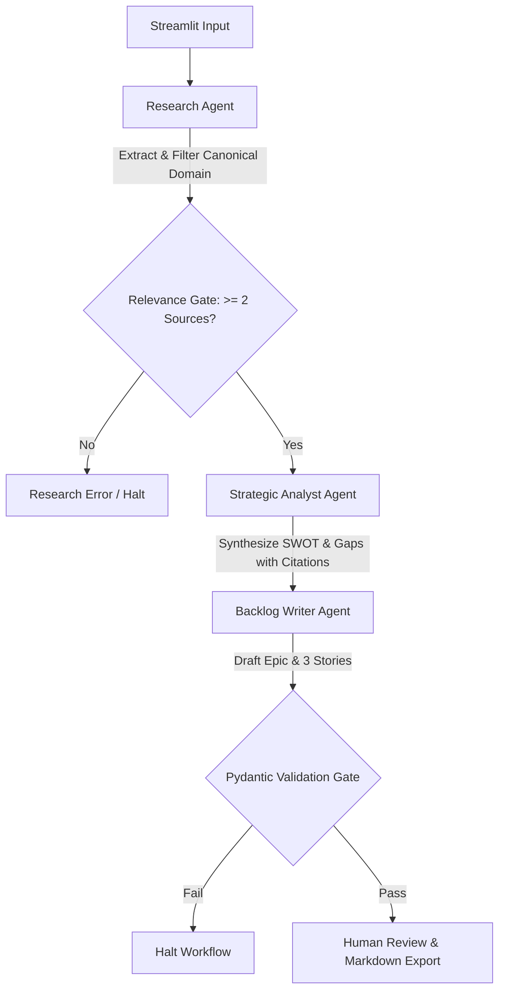

# Product Requirements Document: Competitor Intelligence Engine

## 1. Product Description, Objectives & OKRs
The **Competitor Intelligence Engine** is an **evidence-grounded agentic AI product intelligence system** designed to automate competitor research, SWOT synthesis, opportunity gap mapping, and backlog drafting. By utilizing a multi-agent LangGraph orchestration pipeline, it converts raw competitor web sources into structured, validated product requirements.

### Objectives & OKRs
* **Objective 1: Accelerate product discovery workflows for product builders.**
  * **KR 1.1**: Reduce the time required to perform competitor analysis and compile BDD user stories from over 2 hours of manual research to under 120 seconds.
  * **KR 1.2**: Ensure that 100% of generated user stories match standard agile formats, containing exactly 3 stories per Epic and 3-5 Given/When/Then acceptance criteria.
* **Objective 2: Provide complete transparency and evidence verification.**
  * **KR 2.1**: Maintain 100% citation completeness, linking every SWOT bullet and opportunity gap to a source ID.
  * **KR 2.2**: Zero extraction of third-party domains in research outputs through strict canonical domain filtering.
* **Objective 3: Ensure cost-efficient and safe public showcase operations.**
  * **KR 3.1**: Enable 100% public prototype uptime via static Demo Mode that consumes $0 in API costs.
  * **KR 3.2**: Protect live APIs from billing spikes by implementing a secure authorization gate for Live Research Mode.

---

## 2. Product Vision & Strategy
The long-term vision for the Competitor Intelligence Engine is to serve as the bridging layer between raw competitor web data and corporate product backlogs. Traditional competitive intelligence tools focus on monitoring and sales enablement. The Competitor Intelligence Engine targets the PM's core requirement: **translating competitor movements into immediately actionable backlog entries**.

By grounding every generated claim in verifiable first-party URLs, we establish trust and eliminate the hallucination risks that prevent product teams from adopting standard LLM search engines.

---

## 3. Hypothesis
* **Hypothesis 1 (Direct Grounding)**: Grounding LLM outputs in specific, validated web source IDs will improve user trust and reduce the time spent verifying competitor claims by at least 70%.
* **Hypothesis 2 (Target Product Context Gating)**: Requiring product managers to input their own product strategy context will result in 100% of generated user stories being framed as differentiated competitive responses, rather than copycat features.
* **Hypothesis 3 (Structured Validation)**: Programmatic schemas (Pydantic validation gates) placed after LLM agents will catch and correct malformed backlog tickets (e.g., stories missing BDD format) before they reach the human reviewer, maintaining backlog formatting consistency.

---

## 4. 3C Analysis
* **Customer**: Product Managers, Product Owners, Strategy Analysts, and Startup Founders. Their core need is fast, validated requirements that reflect competitor positioning.
* **Company (Builder)**: Building a fast, lightweight, and cost-controlled agentic workspace deployed as a web application prototype.
* **Competition / Alternatives**: Manual competitive intelligence collection (copy-pasting text from browser tabs) and high-cost enterprise competitor trackers (Klue, Crayon) that do not generate agile requirements or validate them via Pydantic.

---

## 5. Target Audience
* **Product Managers (PMs) & Product Owners (POs)**: Seeking to quickly draft user stories for engineering sprints based on competitor shifts.
* **Startup Founders**: Seeking to quickly run SWOT sweeps and find market opportunity gaps.
* **Strategy & Market Intelligence Analysts**: Seeking to produce verifiable competitor briefs for strategic planning.
* **AI Product Builders**: Evaluating advanced agentic patterns, Pydantic validation gates, and LangGraph pipelines.

---

## 6. Features Table

| Feature Name | Description | Priority | Execution Mode | Status |
| :--- | :--- | :--- | :--- | :--- |
| **Demo Mode** | Fictional, static competitor dataset mimicking NimbusFlow analysis. Consumes no API tokens. | P0 | Static / Offline | ✅ Complete |
| **Live Research Mode** | Real-time public competitor web search and synthesis based on a user-submitted URL. | P0 | Live | ✅ Complete |
| **Access Control Gate** | A secure credential validation gate preventing unauthorized live API billing. | P0 | Live | ✅ Complete |
| **First-Party Relevance Gate** | Enforces that only URLs matching the canonical competitor domain are analyzed. | P0 | Live | ✅ Complete |
| **Target Strategy Context** | Input text area to frame requirements as differentiated responses for *our* product. | P0 | Live / Demo | ✅ Complete |
| **Structured SWOT** | Generated SWOT analysis where every claim contains at least one source ID. | P0 | Live / Demo | ✅ Complete |
| **Opportunity Gaps** | List of 3 to 5 gaps, each mapped to a source ID. | P0 | Live / Demo | ✅ Complete |
| **Agile Backlog Writer** | Formulates 1 Epic and exactly 3 User Stories with BDD acceptance criteria. | P0 | Live / Demo | ✅ Complete |
| **Pydantic Validation Gate** | Enforces formatting rules (e.g. BDD syntax) programmatically. | P0 | Live / Demo | ✅ Complete |
| **Markdown Export** | Single-click download of the generated analysis and requirements brief. | P1 | Live / Demo | ✅ Complete |
| **Multi-Query Fallback** | Sequential queries (site-scoped) to maximize source recall. | P1 | Live | ✅ Complete |

---

## 7. Success Metrics & KPIs
* **Time Saved per Sprint**: The average time saved by a PM to compile competitive stories (Target: > 90% reduction vs. manual).
* **Backlog Completion Rate**: Percentage of runs that complete the agent pipeline and Pydantic validation without errors (Target: > 95%).
* **Evidence Traceability Score**: Percentage of claims in SWOT and Gaps that contain a valid, matching source link (Target: 100%).
* **Adoption Rate**: Number of unique research runs performed in the Demo and Live environments.
* **Human Review Usefulness**: Percentage of generated User Stories that require no manual text correction before import into Jira (Target: > 75%).

---

## 8. Functional Requirements

### 8.1 Input Specifications
* The system shall accept a validated competitor URL (HTTP/HTTPS, non-localhost, non-loopback).
* The system shall accept an optional **Target Product / Strategy Context** text string to steer the Backlog Writer.

### 8.2 Execution Profile & Modes
* **Demo Mode**: 
  * The system shall bypass Tavily and OpenAI APIs and return predefined, high-quality static competitor data for `nimbusflow.example`.
* **Live Research Mode**:
  * The system shall prompt the user for a secure live research access code.
  * The system shall run the Research Agent using the Tavily API, normalise URLs, extract canonical domains, and verify domains.
  * The system shall filter out all third-party URLs, requiring at least 2 distinct first-party sources to continue.

### 8.3 Outputs & Exporter
* The system shall render the analysis across five user-friendly tabs:
  1. **Executive Summary**
  2. **SWOT Analysis** (with source citations)
  3. **Opportunity Gaps** (with source citations)
  4. **Product Backlog** (1 Epic, exactly 3 User Stories with BDD criteria)
  5. **Evidence Sources** (with clickable verified URLs)
* The system shall provide a button to download the entire structured analysis as a Markdown brief.

---

## 9. Non-Functional Requirements

### 9.1 Security & Safety
* **Zero Leakage**: The system shall catch raw provider exceptions and map them to generic user-facing alerts. Under no circumstances should raw API tokens, system prompts, or stack traces be rendered in the UI.
* **Security Validation**: Live mode authorization code verification shall implement constant-time string comparison (`hmac.compare_digest`) to protect against timing attacks.

### 9.2 Reliability & Validation Gates
* **Strict Validation**: The system shall validate LLM outputs using strict Pydantic v2 validation. If the LLM generates a story that does not contain BDD format (`Given/When/Then`), the execution must raise a validation exception rather than silent failure.
* **Prompt Injection Defense**: External page data fetched by Tavily shall be formatted within a clearly demarcated boundary (`--- START UNTRUSTED REFERENCE MATERIAL ---`) to prevent competitive copy from hijacking LLM instructions.

### 9.3 Performance & Cost Control
* **Search Cap**: Tavily searches shall be capped at a maximum of 5 results per query.
* **Early Stopping**: The search agent shall stop executing subsequent queries as soon as 2 or more distinct first-party competitor sources are found.
* **Hosting**: The application shall deploy seamlessly on Hugging Face Spaces using Docker, mapping to port 7860.

---

## 10. User Stories

### Story 1: Research Traceability
**As a** Senior Product Manager,  
**I want to** click on source citations directly within the generated SWOT analysis,  
**So that** I can instantly verify the source URLs of competitor claims before presenting strategy to my engineering leads.

* **Acceptance Criteria 1**:
  * **Given** a successfully generated SWOT analysis in the UI,  
  * **When** I inspect a strength or weakness item,  
  * **Then** I must see one or more source IDs (e.g., `SRC-1`) rendered as clickable markdown links.
* **Acceptance Criteria 2**:
  * **Given** a user click on a source citation link,  
  * **When** the browser processes the request,  
  * **Then** it must open the corresponding public competitor URL in a new tab.

### Story 2: Differentiated Backlog Generation
**As a** Startup Founder,  
**I want to** input my target company’s strategic constraints along with a competitor's URL,  
**So that** the generated backlog stories address our unique competitive response rather than copying the competitor's feature set.

* **Acceptance Criteria 1**:
  * **Given** the Live Research Mode or Demo Mode interface,  
  * **When** I type my custom strategy guidelines into the Target Product / Strategy Context input box,  
  * **Then** the generated Epic and user stories must align with my strategy and refer to my product's objectives.
* **Acceptance Criteria 2**:
  * **Given** a generated Epic title,  
  * **When** the backlog output is compiled,  
  * **Then** it must not contain the name of the competitor or propose improvements directly inside the competitor's software.

### Story 3: Schema Compliance for Agile Imports
**As an** Agile Product Owner,  
**I want** the generated backlog stories to strictly adhere to BDD formatting and user story syntax,  
**So that** I can import them into Jira without manual formatting corrections.

* **Acceptance Criteria 1**:
  * **Given** an Epic generated by the backlog agent,  
  * **When** the Pydantic parser evaluates the output,  
  * **Then** it must contain exactly three user stories.
* **Acceptance Criteria 2**:
  * **Given** the user stories written by the agent,  
  * **When** validation checks are executed,  
  * **Then** every acceptance criterion must contain 'Given', 'When', and 'Then' keywords, failing the run if not present.

---

## 11. Agentic Workflow Requirements
The system utilizes a structured, deterministic LangGraph state machine. Below is the state transition flow:

1. **Research Agent**: normalizes the domain and queries public web databases. Enforces a multi-query fallback loop if initial search recall is insufficient.
2. **Relevance Gate**: Confirms that a minimum of 2 sources match the competitor domain. Filters out unrelated sites.
3. **Strategic Analyst Agent**: Extracts claims, formats SWOT points, and maps opportunity gaps. Verifies that every assertion points to a source in the research list.
4. **Backlog Writer Agent**: Combines the SWOT gaps and the target strategy context input to draft the Epic and stories.
5. **Pydantic Validation Node**: Programmatically checks the schemas (regex BDD validation, story counts) before saving the state.
6. **Human Review / UI**: Renders the complete output and allows the user to download the Markdown file.

---

## 12. AI Safety, Guardrails & Human Review
* **Human Validation Disclaimer**: The UI must display a standard notice: *"This is a prototype designed for demonstration purposes... Keep human-in-the-loop validation active prior to acting on generated backlog elements."*
* **Groundedness Over Completeness**: The system does not guarantee that the analysis is exhaustive. It guarantees that whatever claims are returned, they are strictly derived from the extracted public texts and matched with source URLs.
* **Untrusted Context Separation**: Real-time competitor webpage text is never mixed directly into the LLM system instructions, preventing prompt injection vectors from malicious competitive web content.

---

## 13. Risks and Mitigations

| Risk | Impact | Likelihood | Mitigation Strategy |
| :--- | :--- | :--- | :--- |
| **Search Recall Failures** (Zero search hits on new/niche domains) | High | Medium | Implement the three-step sequential site-scoped search fallback loop to catch deeply indexed subpages. |
| **Hallucinated Citations** (Fake or mismatched `source_ids`) | High | Low | Programmatically validate LLM citations by comparing referenced IDs against the list of parsed sources in a custom validator node. |
| **API Costs & Billing Overrun** | High | High | Gate all Live Research Mode queries behind a secure local access code, using constant-time string checks. Limit search outputs to a maximum of 5 per query. |
| **Agile Schema Violations** (LLM returns 2 or 4 stories instead of 3) | Medium | Medium | Wrap agent outputs in strict Pydantic model calls that throw validation errors, preventing malformed data from rendering. |

---

## 14. Strategic Insight
The Competitor Intelligence Engine proves that generative AI products are most effective when they do not try to solve the entire problem in a single prompt. Dividing the product discovery workflow into discrete, validated agent nodes ensures that the final output is highly structured, source-grounded, and instantly valuable to real product teams.

For more details on the portfolio showcase context, visit [Avishek's Portfolio Hub](https://portfolio.example.com) *(Placeholder)*.
